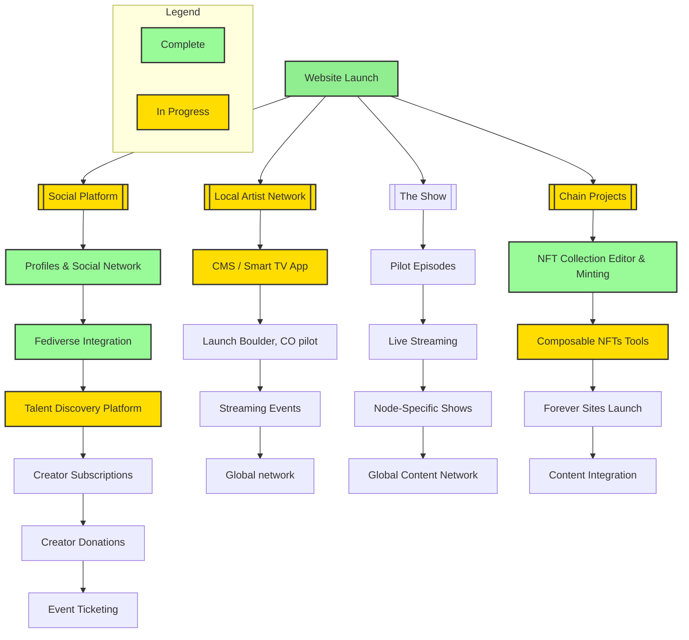

# Distributed Creatives: Empowering Creators in the Digital Age

Holos Due Diligence Package (April 2025)

<aside>

**Contents**

</aside>

<aside>

**Executive Summary**

Distributed Creatives is a 501(c)(3) nonprofit organization revolutionizing the creator economy through an integrated ecosystem of digital infrastructure and community programs designed to empower artists and creative professionals. Our mission addresses critical challenges of the digital age: ensuring fair compensation, preserving creative works, and putting technology in service of creativity rather than replacing it.

**Core Programs**

- **Creator Advocacy Framework**: Unites creators across disciplines through the Declaration for Creators in the Digital Age, establishing common principles for membership, partnerships, and advocacy efforts.
- **Local Artist Network (LAN)**: Transforms cities into living galleries through digital signage and interactive platforms connecting artists, venues, and audiences, with initial deployment in Boulder, Colorado.
- **Musely.social Platform**: Provides a comprehensive social network with 100% profit-to-creator monetization tools, integrating community engagement features with subscription, donation, and e-commerce capabilities.
- **Forever Sites**: Creates permanent digital archives for creative works through decentralized storage solutions, ensuring content remains accessible for generations.
- **The Show**: Delivers weekly broadcast events featuring artist showcases, performances, and industry insights, providing global exposure through multi-platform streaming.

**Financial Outlook:**

- Projected revenue growth from $297,240 (Year 1) to $42,214,000 (Year 4), with 97% derived from earned revenue streams.
- Sustainable operations achievable at 3,000 members, with scaling capacity to 120,000+ users.
- Tiered investment opportunities from $50,000 to $119,000 supporting progressive expansion.

**Leadership:**

Our board combines over 100 years of experience in grant management, technological innovation, and community development, having secured more than $25 million in funding and delivered 100+ digital products across creative sectors.

Distributed Creatives stands at the intersection of technology and creativity, building both the digital infrastructure and community structures needed to deliver immediate value to creators while fostering long-term systemic change through united advocacy across creative disciplines.

</aside>

---

# Programs

## Creator Advocacy Framework

<aside>
🔗

[**New website preview**](https://dc-creator-advocacy-framework.vercel.app/)

</aside>

<aside>

- **Vision**: Distributed Creatives unites creators across disciplines to address digital age challenges: AI systems using creative works without permission, unfair profit distribution, and technology replacing rather than empowering creativity.
- **Core Principles**: Founded on United Creator Voice, Technology in Service of Creativity, Fair Value Exchange, Creator Sovereignty, Transparency, Global-Local Impact, and Legacy Preservation.
- **Framework**: Provides a coherent narrative that connects all organizational initiatives through the Declaration for Creators in the Digital Age, establishing common language and principles that inform membership structure, partnerships, municipal programs, and advocacy efforts.
- **Empowerment Strategy**: Creates both technological infrastructure (digital signage, rights management tools) and community structures (tiered membership, local chapters) that work together to deliver immediate value to creators while building long-term systemic change through united advocacy across creative disciplines.
</aside>

---

## **Local Artist Network**

<aside>
🔗

https://distributedcreatives.org/lan/

</aside>

<aside>

- The Local Artist Network is a revolutionary digital infrastructure that connects and empowers local art ecosystems, creating a vibrant network of artists, venues, and art enthusiasts while maintaining power in the hands of creatives and local communities.
- Through strategic deployment of digital signage, interactive platforms, and creator-first tools, LAN transforms cities into living galleries where artists can build sustainable careers, venues become cultural hubs, and communities experience enhanced economic and cultural growth.
- Launching first in Boulder, Colorado, LAN aims to create a replicable model that can scale globally, with projected membership growth ranging from 2,500 to 34,000 members in the first year and a sustainable revenue model that reinvests 65% back into the local creative economy.
- The platform combines physical and digital presence through high-definition displays in public spaces, smart TV applications, live streaming capabilities, and comprehensive creator profiles - all designed to facilitate direct engagement between artists and their communities.
</aside>

---

## [Musely.social](http://Musely.social) Platform

<aside>
🔗

[**musely.social**](http://musely.social)

</aside>

> Unlike for-profit creator platforms, Musely gives 100% of the profit to the creators!
> 

<aside>

Musely is a comprehensive social networking platform built specifically for creatives, integrating community engagement tools with robust monetization features. *Musely provides a unified central platform for all the Distributed Creatives programs.*

- **Community Building & Engagement**
    - Full-featured social networking with activity streams, user profiles, groups, and messaging
    - Event management and ticketing system with venue integration
    - Interactive forums and community spaces for collaboration
    - Cross-platform content sharing through Fediverse integration
- **Creator Monetization Suite**
    - Multiple revenue streams including donations, subscriptions, and digital product sales
    - NFT gallery integration with blockchain connectivity
    - Job board and classified ad system for opportunity sharing
    - Integrated e-learning platform for course creation and delivery
- **Professional Tools & Infrastructure**
    - Custom page builder for personalized landing pages
    - Advanced analytics and performance tracking
    - Secure user authentication and privacy controls
    - Mobile-responsive design with optimized performance
</aside>

---

## Forever Sites

<aside>
🔗

https://distributedcreatives.org/chain/forever/

</aside>

<aside>

- **Crisis & Solution:** Forever Sites addresses the critical issue of digital impermanence by creating a decentralized, permanent archive system that preserves creative and cultural works through multiple storage solutions including Arweave, Filecoin, and secure physical vaults, ensuring content remains accessible for generations to come.
- **Technical Infrastructure:** The platform utilizes blockchain technology for authentication, AI-assisted format conversion for future compatibility, and [Schema.org](http://schema.org/) metadata frameworks for content organization, with a one-time payment model (~$10/GB) for perpetual storage and preservation.
- **Universal Access & Authenticity:** Through a free decentralized application (dApp), creators can contribute their work while maintaining provenance through C2PA standards and blockchain verification, with special designation for officially verified content from copyright holders and established institutions.
</aside>

---

## The Show

<aside>

- **Format & Structure:** The Show is a 60-minute weekly broadcast event featuring a dynamic variety show format with segments including artist showcases, live performances, collaborative projects, and industry insights, designed to highlight both emerging and established creative talents.
- **Global Platform:** Through multi-platform streaming and innovative technology integration, The Show provides artists worldwide with professional-quality production resources, including hardware, software, producers, showrunners, and technical staff to create engaging content that reaches diverse audiences.
- **Special Programming:** Beyond weekly episodes, The Show features monthly spectaculars (4-hour events), quarterly festivals (48-hour programming), and an annual awards ceremony, incorporating cutting-edge features like holographic performances, virtual reality experiences, and interactive audience participation.
</aside>

---

# Events

## eARTh pARTy Conference 2025

<aside>
🔗

[**eARTh pARTy Conference 2025**](https://dc-earth-party-conference-2025.vercel.app/)

</aside>

<aside>

- A transformative three-day gathering (July 11-13, 2024) at Forbes Island in the Sacramento Delta in the Bay Area of California, bringing together visionary technologists, artists, and cultural leaders to shape the future of decentralized, regenerative creative economies.
- Four cornerstone panels exploring: Creative Ecosystems & Community Spaces, Forever Sites & Digital Preservation, Regenerative Futures & Earth-Aligned Communities, and Distributed Creatives' vision for transforming the creative economy. Featured speakers include leaders from Internet Archive, Bloom Network, and pioneering cultural institutions.
- Unique off-grid venue demonstrating sustainable living practices, featuring interactive workshops, art performances, and collaborative sessions aimed at building practical frameworks for a decentralized creative global network.
</aside>

---

# Technology

## [NFTr.pro](http://NFTr.pro): Mintr Web3 Content Management

[https://www.youtube.com/watch?v=CeMj-P3LPHY](https://www.youtube.com/watch?v=CeMj-P3LPHY)

<aside>
🔗

**Home site: [NFTr.pro/Mintr](https://nftr.pro/)**

</aside>

<aside>
🔗

**News:** [https://nftr.pro/news/](https://nftr.pro/news/)

</aside>

<aside>

- Mintr is a comprehensive web application designed to simplify the entire NFT lifecycle on the Chia blockchain, developed through a $60K grant awarded to Sumset Tech (Grig Bilham) through the Chia grant program.
- The platform offers robust features including decentralized file storage for creative assets (with assets saved locally), integration with storage solutions like NFT.storage, Arweave, and Pinata to provide permanent, verifiable storage for Forever Sites.
- Mintr includes a custom smart contract implementation for rights management, enabling creators to maintain control over their intellectual property while seamlessly managing the preparation, minting, and monetization of their NFT collections.
- The tool supports diverse asset types (images, videos, 3D objects, documents) and provides powerful management capabilities including catalog search, batch operations, media transcoding, and rarity scoring, all designed to drive adoption of the Chia blockchain ecosystem.
</aside>

---

## Fusion: Composable NFTs

<aside>

**Use Cases**

- **Music Production:** Artists create stems as NFTs, producers combine them with automated royalty distribution
- **Visual Art:** Artists offer elements as NFTs for combination into new artworks
- **Literature:** Authors tokenize phrases, characters, or plot elements for new stories
- **Multimedia:** Combination of music, visuals, text, and interactive elements
- **3D Assets:** Creators offer models, animations, and environments for use in games, films, and metaverse applications
</aside>

<aside>
🔗

[**Composable NFTs**](https://distributedcreatives.org/chain/composable/)

</aside>

<aside>
🔗

[**Fusion details**](https://nftr.pro/understand-the-background-of-design/)

</aside>

<aside>

**Overview**

Composable NFTs represent a breakthrough in digital asset management that enables dynamic, interactive creation and collaboration while maintaining transparent attribution and fair compensation for all contributors.

**Core Technology**

- Modular digital assets that can be combined, separated, and recombined to create new NFTs
- Smart contracts that manage rights, royalties, and ownership across complex collaborations
- Blockchain-based provenance tracking for complete transparency
- Ability to extract and reuse original components from composite works

**Key Features**

- Trustless combination and division of digital assets on-chain
- Automated royalty distribution to all contributors
- Immutable record of artistic lineage and collaboration
- Integration with traditional art market databases

**Technical Implementation**

- Primary implementation on Ethereum with Layer 2 scaling solutions
- Cross-chain bridges for multi-blockchain ecosystem support
- Decentralized storage (IPFS) with redundant backups
- Modular smart contract architecture

**Economic Model**

- Direct peer-to-peer royalty payments through smart contracts
- No platform fees or intermediaries

**Benefits**

- Enables seamless artistic collaboration across time and space
- Ensures fair compensation for all contributors
- Creates new opportunities for artistic innovation
- Maintains transparent provenance and rights management
</aside>

---

# Documentation

## Memorandum of understanding

[Holos <> Distributed Creatives MOU Draft - Mar 31, 2025](Holos%20Distributed%20Creatives%20MOU%20Draft%20-%20Mar%2031,%2020%201c8faa2a7b8a800f8f05d5005056aa0b.md) 

---

## **Deck: Roadmap To Success 2025**

<aside>
🔗

[Distributed Creatives - Roadmap To Success .pdf](Distributed_Creatives_-_Roadmap_To_Success_.pdf)

</aside>

<aside>

- Distributed Creatives is a 501(c)(3) nonprofit organization revolutionizing the creator economy through digital infrastructure that provides artists with complete ownership of their content and revenue streams, returning 60% of revenue directly to creators.
- Their ecosystem consists of five key programs: Local Artist Network (LAN) connecting artists with venues through digital displays, Musely.social platform for creator networking and monetization, The Show for artist showcasing, Forever Sites for permanent digital preservation, and Composable NFTs for fair creative compensation.
- The organization has a phased rollout plan starting in Boulder with initial venue partnerships, planning to scale globally by 2027, with revenue projected to grow from $0.6M in Year One to $84.1M by Year Four, primarily driven by sponsorship/advertising revenue.
- Their funding needs are tiered ($50K-$119K) to support operations, platform development, network expansion, and video production capabilities, with a strong leadership team already in place and the fundamental components of their ecosystem launched.
</aside>

---

## Roadmap

- Completed: Website Launch and initial infrastructure
- In Progress: Core platform features including Fediverse integration, NFT Collection Editor, and CMS development
- Planned: Advanced features and global expansion across all tracks

- **Musely.social Platform**: Progressing from basic profiles to full Fediverse integration, evolving into a comprehensive talent discovery platform with monetization features including creator subscriptions, donations, and event ticketing.
- **Local Artist Network**: Beginning with a CMS/Smart TV app implementation, launching a pilot program in Boulder, CO, then expanding to streaming events and ultimately developing into a global network.
- **The Show**: Starting with pilot episodes, advancing through live streaming capabilities to node-specific shows, culminating in a global content network.
- **Chain Projects**: Focusing on NFT technologies, from collection editing and minting to composable NFT tools, leading to Forever Sites launch and content integration.

---

# Financial Overview 2025-2028

<aside>
🔗

Detailed Budget & Projections: **[DC Budget Overview 2025](https://docs.google.com/spreadsheets/d/1uxTk7jKjI9NusQ0X-qjCYgO4sqAcZH8FMb0ZyxqP_0Y/preview?usp=sharing)**

</aside>

[[https://docs.google.com/spreadsheets/d/1uxTk7jKjI9NusQ0X-qjCYgO4sqAcZH8FMb0ZyxqP_0Y/edit?usp=sharing](https://docs.google.com/spreadsheets/d/1uxTk7jKjI9NusQ0X-qjCYgO4sqAcZH8FMb0ZyxqP_0Y/edit?usp=sharing)](https://docs.google.com/spreadsheets/d/1uxTk7jKjI9NusQ0X-qjCYgO4sqAcZH8FMb0ZyxqP_0Y/preview?usp=sharing)

## Revenue Trajectory

- **Total Revenue Growth**: $297,240 (Y1) → $1,469,320 (Y2) → $6,152,600 (Y3) → $42,214,000 (Y4)
- **Four-Year Revenue**: $50,133,160
- **Year-Over-Year Growth**: 394% (Y1-Y2), 319% (Y2-Y3), 586% (Y3-Y4)

## Revenue Composition

- **Earned Revenue**: $48,608,160 (97.0% of total)
    - Sponsor Paid LAN Impressions: $6,474,000 (13.4% of total revenue)
    - Membership Fees: $12,883,920 (25.7% of total revenue)
    - User Ad Revenue: $29,250,240 (58.3% of total revenue)
- **Contributed Revenue**: $1,525,000 (3.0% of total)
    - Individual Donations: $610,000 (1.2% of total revenue)
    - Corporate Sponsorships: $915,000 (1.8% of total revenue)

## Key Revenue Drivers

- **LAN Network**: Scaling from 3 venues to 40 venues
- **Impression Value**: Increasing from $0.02 to $2.50 per impression
- **Membership**: Monthly fees increasing from $10 to $15
- **User Base**: Growing from 200 to 120,000 users
- **In-App Advertising**: User campaigns growing from 2% to 3.25% of user base

## Expense Structure

- **Total Four-Year Expenses**: $1,558,321
- **Program Expenses**: $245,321 (33.5% of total)
    - Media Hosting: $150,000 (19.4%)
    - Live Streaming Hardware: $22,500 (1.2%)
    - Forever Storage: $22,000 (2.8%)
    - Display Screens: $20,000 (5.2%)
- **Administrative Expenses**: $1,193,500 (76.6% of total)
    - Staff Salaries: $1,137,400 (scaling from 2 to 8 team members)
    - Professional Services: $52,000
    - Office Expenses: $4,100
- **Fundraising Expenses**: $119,500 (7.7% of total)
    - Fundraising Events: $62,500
    - Grant Writing: $26,000
    - Donor Management: $31,000

## Profitability & Sustainability

- **Net Operating Income**: $171,223 (Y1) → $1,223,896 (Y2) → $5,692,728 (Y3) → $41,486,992 (Y4)
- **Four-Year Accumulated Net Income**: $48,574,839
- **Profit Margin**: 57.6% (Y1) → 83.3% (Y2) → 92.5% (Y3) → 98.3% (Y4)
- **Break-Even Point**: Sustainable operations at 3,000 members ($30,000 monthly revenue)

## Investment Requirements

- **Tier One**: $50,000 for essential operations and LAN launch (3 venues)
- **Tier Two**: $50,000 for membership platform enhancements
- **LAN Scale**: $119,000 for expansion to 10+ venues
- **4K Video Production**: $20,000 for content creation infrastructure

---

# Board of Directors

The Distributed Creatives Board of Directors brings together over 100 years of combined experience in grant management, community development, technological innovation, and cultural programming. Our leadership team has collectively secured more than $25 million in grant funding, successfully delivered over 100 digital products, managed numerous cultural venues, and built sustainable creative communities across the United States.

This exceptional team unites diverse expertise in blockchain technology, environmental conservation, festival production, community organizing, and educational programming to create innovative solutions for the creative economy. Each director contributes specialized knowledge and proven success in developing sustainable funding models, implementing complex projects, and building vibrant creative ecosystems.

## **Grig Bilham - Co-Founder/President**

Technology entrepreneur and creative economy innovator. Founded Sumset Tech, developing blockchain solutions for digital preservation. Led multiple successful Web3 projects and community initiatives.

https://distributedcreatives.org/team/#grig

https://www.linkedin.com/in/grigb/

## **Matty Bovard - Co-Founder/Board Member**

Artist and community builder with extensive experience in digital art markets and creator advocacy. Pioneer in NFT art spaces and creative technology adoption.

https://distributedcreatives.org/team/#matty

https://www.linkedin.com/in/matty-bovard/

## **Heidi Petty - Board Member**

Experienced event producer and community organizer. Specialist in sustainable creative economies and artist support systems.

https://distributedcreatives.org/team/#heidi

https://www.linkedin.com/in/heidi-petty-47887aa2/

## **Dr. Brian Hewlett - Board Member**

Academic and researcher focused on digital preservation and creative technologies. Expert in community governance models and decentralized systems.

https://distributedcreatives.org/team/#brian

https://www.linkedin.com/in/briannhewlett/