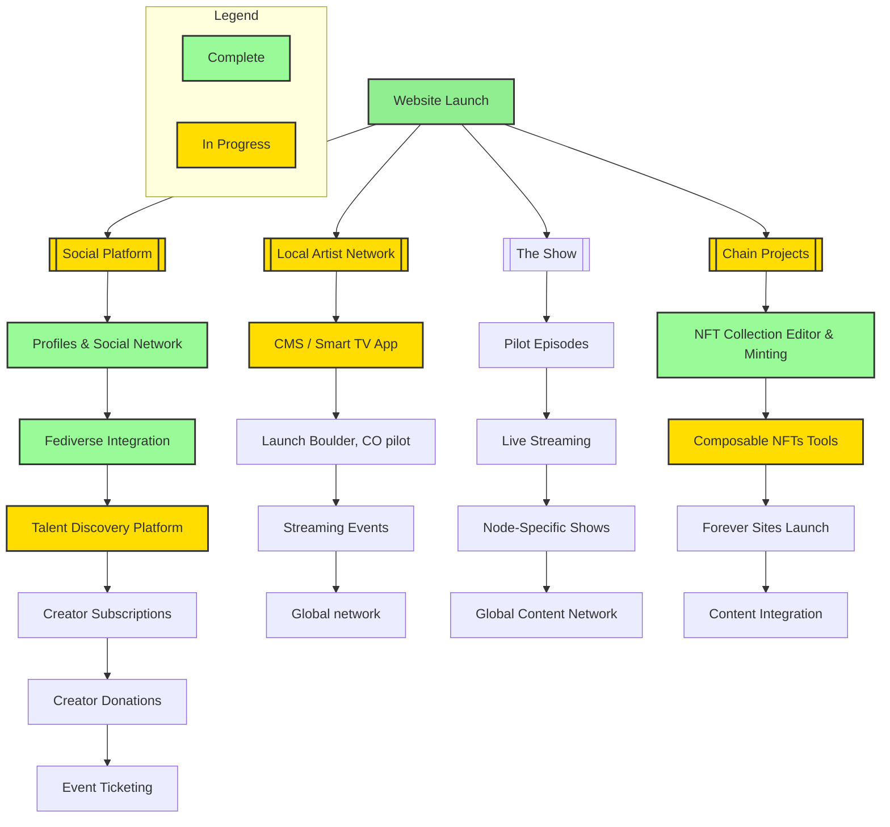

# Distributed Creatives Project Roadmap 2

```mermaid
graph TD
    Website["Website Launch"] --> LAN[["Local Artist Network"]]
    Website --> CT[["Social Platform"]]
    Website --> Chain[["Chain Projects"]]
    Website --> Show[["The Show"]]

    %% Fediverse Track
    CT --> Fedi["Profiles & Social Network"]
    Fedi --> FediP["Fediverse Integration"]
    FediP --> FediC["Talent Discovery Platform"]
    FediC --> FediS["Creator Subscriptions"]
    FediS --> FediA["Creator Donations"]
    FediA --> FediD["Event Ticketing"]

    %% LAN Track
    LAN --> LANV["CMS / Smart TV App"]
    LANV --> LAND["Launch Boulder, CO pilot"]
    LAND --> LANC["Streaming Events"]
    LANC --> LANG["Global network"]

    %% Show Track
    Show --> ShowP["Pilot Episodes"]
    ShowP --> ShowL["Live Streaming"]
    ShowL --> ShowN["Node-Specific Shows"]
    ShowN --> ShowG["Global Content Network"]

    %% Chain Track
    Chain --> ChainC["NFT Collection Editor & Minting"]
    ChainC --> ChainN["Composable NFTs Tools"]
    ChainN --> ChainF["Forever Sites Launch"]
    ChainF --> ChainR["Content Integration"]

    %% Legend
    subgraph Legend
        Complete[Complete]
        InProgress[In Progress]
    end

    %% Style definitions
    classDef main fill:#90EE90,stroke:#333,stroke-width:2px
    classDef third fill:#98FB98,stroke:#333,stroke-width:2px
    classDef orange fill:#FFDD00,stroke:#333,stroke-width:2px
    classDef legendComplete fill:#98FB98,stroke:#333,stroke-width:2px
    classDef legendProgress fill:#FFDD00,stroke:#333,stroke-width:2px

    %% Apply styles
    class Website main
    class CT,LAN,Chain orange
    class Fedi,FediP,ChainC third
    class ChainN,FediC,LANV orange
    class Complete legendComplete
    class InProgress legendProgress
```