# LAN COMPREHENSIVE DESIGN DOCUMENT

## EXECUTIVE SUMMARY

The Local Artist Network (LAN) platform is a comprehensive ecosystem connecting artists, venues, and audiences across multiple platforms:

- **Web Backend** for content management and administration
- **Digital Signage Application** for venue displays
- **Smart TV Application** for home/hotel viewing
- **Mobile Application** for ticketing and on-the-go access

This comprehensive design document provides all specifications needed for interface design and development, with particular focus on the content publishing workflow as the critical MVP component.

## TABLE OF CONTENTS

1. [Design Principles & Brand Identity](https://claude.ai/chat/8b46978f-3398-469b-aeee-52ae07750cb7#1-design-principles--brand-identity)
2. [Component Library](https://claude.ai/chat/8b46978f-3398-469b-aeee-52ae07750cb7#2-component-library)
3. [Core User Flows](https://claude.ai/chat/8b46978f-3398-469b-aeee-52ae07750cb7#3-core-user-flows)
4. [Platform-Specific Architecture](https://claude.ai/chat/8b46978f-3398-469b-aeee-52ae07750cb7#4-platform-specific-architecture)
5. [Technical Specifications](https://claude.ai/chat/8b46978f-3398-469b-aeee-52ae07750cb7#5-technical-specifications)
6. [Implementation Plan](https://claude.ai/chat/8b46978f-3398-469b-aeee-52ae07750cb7#6-implementation-plan)
7. [Integrations & Dependencies](https://claude.ai/chat/8b46978f-3398-469b-aeee-52ae07750cb7#7-integrations--dependencies)
8. [Critical Task Analysis](https://claude.ai/chat/8b46978f-3398-469b-aeee-52ae07750cb7#8-critical-task-analysis)
9. [UI Mockups](https://claude.ai/chat/8b46978f-3398-469b-aeee-52ae07750cb7#9-ui-mockups)
10. [Appendix](https://claude.ai/chat/8b46978f-3398-469b-aeee-52ae07750cb7#10-appendix)

---

## 1. DESIGN PRINCIPLES & BRAND IDENTITY

### 1.1 Core Design Principles

| Principle | Description | Application |
| --- | --- | --- |
| **Artistic Integrity** | Showcase creative work with minimal interference | Clean layouts, focus on content, neutral backgrounds |
| **Inclusive Access** | Make art accessible to diverse audiences | Accessible design, clear language, multi-platform approach |
| **Contextual Relevance** | Present content with appropriate context | Location awareness, cultural context, historical connections |
| **Seamless Transitions** | Create fluid movement between physical and digital | Consistent cross-platform experience, QR integration, continuity |
| **Community Connection** | Foster relationships between artists, venues, and audiences | Collaborative tools, feedback systems, local focus |

### 1.2 Brand Identity

**Brand Essence:** LAN connects local artists, venues, and audiences through a seamless digital ecosystem that extends the artistic experience beyond physical limitations.

**Brand Voice:**

- **Tone:** Professional yet approachable, knowledgeable but not pretentious
- **Language:** Clear, concise, inclusive, and jargon-free
- **Personality:** Supportive, community-focused, culturally aware, and forward-thinking

**Brand Promise:** LAN enhances the local arts ecosystem by creating meaningful connections, increasing visibility, and providing valuable tools for all stakeholders.

### 1.3 Visual Identity System

### Color System

**Primary Palette:**

| Color | Hex | RGB | Usage | Accessibility |
| --- | --- | --- | --- | --- |
| Gold | `#E9B949` | 233, 185, 73 | Primary accent, CTAs, highlights | Passes AA on dark backgrounds |
| Dark Gold | `#D4A149` | 212, 161, 73 | Hover states, secondary accents | Passes AA on light backgrounds |
| Light Gold | `#F0C674` | 240, 198, 116 | Subtle accents, backgrounds | Use with dark text only |

**Secondary Palette:**

| Color | Hex | RGB | Usage | Accessibility |
| --- | --- | --- | --- | --- |
| Warm Brown | `#C8976C` | 200, 151, 108 | Secondary accents, category indicators | Passes AA on dark backgrounds |
| Dark Brown | `#B78D65` | 183, 141, 101 | Hover states, borders | Passes AA on light backgrounds |
| Light Brown | `#D9B38C` | 217, 179, 140 | Subtle accents, backgrounds | Use with dark text only |

**Neutral Palette:**

| Color | Hex | RGB | Usage | Accessibility |
| --- | --- | --- | --- | --- |
| Dark (Background) | `#121212` | 18, 18, 18 | Dark mode background | Base for dark mode |
| Dark Card | `#1E1E1E` | 30, 30, 30 | Dark mode card background | Subtle contrast with background |
| Dark Muted | `#2D2D2D` | 45, 45, 45 | Dark mode secondary elements | Subtle elevation |
| Light (Background) | `#FFFFFF` | 255, 255, 255 | Light mode background | Base for light mode |
| Light Card | `#F8F8FC` | 248, 248, 252 | Light mode card background | Subtle contrast with background |
| Light Muted | `#F0F0F0` | 240, 240, 240 | Light mode secondary elements | Subtle elevation |

**Text Colors:**

| Color | Hex | RGB | Usage | Accessibility |
| --- | --- | --- | --- | --- |
| Dark Text | `#121212` | 18, 18, 18 | Primary text on light backgrounds | 21:1 contrast ratio on white |
| Light Text | `#FFFFFF` | 255, 255, 255 | Primary text on dark backgrounds | 21:1 contrast ratio on black |
| Dark Muted Text | `#4A4E54` | 74, 78, 84 | Secondary text on light backgrounds | 4.5:1 contrast ratio on white |
| Light Muted Text | `#ABABAB` | 171, 171, 171 | Secondary text on dark backgrounds | 4.5:1 contrast ratio on black |

**Semantic Colors:**

| Purpose | Light Mode | Dark Mode | Usage |
| --- | --- | --- | --- |
| Success | `#10B981` | `#34D399` | Confirmations, completions |
| Warning | `#F59E0B` | `#FBBF24` | Alerts, cautions |
| Error | `#EF4444` | `#F87171` | Errors, destructive actions |
| Info | `#3B82F6` | `#60A5FA` | Information, help |

**Color Application Guidelines:**

1. **Contrast Requirements:**
    - Text must maintain 4.5:1 contrast ratio with its background (WCAG AA)
    - Large text (18pt+) must maintain 3:1 contrast ratio with its background
    - UI components must maintain 3:1 contrast with adjacent colors
2. **Color Combinations:**
    - Primary text on background: Always use highest contrast option
    - Secondary text: Use muted text colors only on base backgrounds
    - Interactive elements: Use primary colors with sufficient contrast
    - Error states: Always use error colors with sufficient contrast
3. **Platform-Specific Adjustments:**
    - TV: Increase contrast by 10% for better visibility at distance
    - Digital Signage: Increase vibrancy by 5% for public display
    - Mobile: Standard color application with high contrast for outdoor use
    - Web: Standard color application with subtle hover states

### Typography System

**Primary Font Family:** Inter (Sans-serif)
**Secondary Font Family:** Source Serif Pro (Serif, for occasional contrast)

**Type Scale:**

| Level | Web/Mobile Size | TV Size | Weight | Line Height | Usage |
| --- | --- | --- | --- | --- | --- |
| Display | 48px/3rem | 72px/4.5rem | 700 | 1.1 | Hero headlines |
| H1 | 36px/2.25rem | 60px/3.75rem | 700 | 1.2 | Main headlines |
| H2 | 30px/1.875rem | 48px/3rem | 600 | 1.2 | Section headlines |
| H3 | 24px/1.5rem | 36px/2.25rem | 600 | 1.3 | Subsection headlines |
| H4 | 20px/1.25rem | 30px/1.875rem | 600 | 1.3 | Card headlines |
| H5 | 18px/1.125rem | 24px/1.5rem | 600 | 1.4 | Minor headlines |
| Body | 16px/1rem | 22px/1.375rem | 400 | 1.5 | Body text |
| Small | 14px/0.875rem | 20px/1.25rem | 400 | 1.5 | Secondary text |
| XSmall | 12px/0.75rem | 18px/1.125rem | 400 | 1.5 | Tertiary text |

**Typography Guidelines:**

1. **Accessibility Requirements:**
    - Minimum text size: 12px on web/mobile, 18px on TV
    - Line height: Minimum 1.5 for body text
    - Letter spacing: Slightly increased (0.01em) for better readability
    - Font weight: Minimum 400 for body text, 600 for headlines
2. **Responsive Behavior:**
    - Scale down by one level at mobile breakpoints below 640px
    - Scale up by one level for TV at distances greater than 8 feet
    - Maintain minimum sizes regardless of scaling
3. **Platform-Specific Adjustments:**
    - TV: Larger sizes, increased weight contrast
    - Digital Signage: Larger sizes, increased weight, reduced content
    - Mobile: Standard scale with minimum 14px for body text
    - Web: Standard scale with responsive adjustments

### Iconography System

**Primary Icon Set:** Lucide Icons (consistent, modern line icons)

**Icon Sizes:**

| Context | Small | Medium | Large | Extra Large |
| --- | --- | --- | --- | --- |
| Web/Mobile | 16px | 24px | 32px | 48px |
| TV | 24px | 32px | 48px | 64px |
| Digital Signage | 32px | 48px | 64px | 96px |

**Icon Guidelines:**

1. **Consistency:**
    - Use Lucide icons exclusively for interface elements
    - Maintain consistent stroke width (2px standard)
    - Use consistent sizing within contexts
2. **Accessibility:**
    - Always include text labels with icons in navigation
    - Use aria-labels for standalone icons
    - Ensure 3:1 contrast ratio against backgrounds
3. **Application:**
    - Use icons sparingly to avoid visual noise
    - Pair with text for important actions
    - Use consistent positioning (left of text for actions)

---

## 2. COMPONENT LIBRARY

### 2.1 Button System

**Button Variants:**

| Variant | Purpose | Visual Treatment | States |
| --- | --- | --- | --- |
| Primary | Main actions, CTAs | Solid gold background, dark text | Default, Hover, Active, Disabled, Loading, Focus |
| Secondary | Alternative actions | Gold outline, gold text | Default, Hover, Active, Disabled, Loading, Focus |
| Tertiary | Minor actions | Gold text only, no background | Default, Hover, Active, Disabled, Loading, Focus |
| Icon | Compact actions | Icon only or icon with text | Default, Hover, Active, Disabled, Loading, Focus |

**Button Sizes:**

| Size | Height | Padding | Text Size | Icon Size | Usage |
| --- | --- | --- | --- | --- | --- |
| Large | 48px | 24px | 16px | 24px | Primary CTAs, hero sections |
| Default | 40px | 16px | 14px | 20px | Standard actions |
| Small | 32px | 12px | 12px | 16px | Compact UI areas |
| Icon | 40px | 8px | n/a | 20px | Icon-only actions |

**Button States:**

| State | Visual Treatment | Behavior |
| --- | --- | --- |
| Default | Standard styling | Ready for interaction |
| Hover | Slight color change, subtle shadow | Visual feedback on hover |
| Active | Darker color, inset appearance | Visual feedback on click/tap |
| Focus | Focus ring, high contrast outline | Keyboard navigation indicator |
| Disabled | Reduced opacity, no hover effects | Indicates unavailable action |
| Loading | Loading indicator, disabled interaction | Shows processing state |

**Button Guidelines:**

1. **Accessibility:**
    - Minimum touch target: 44px × 44px
    - Focus indicators visible in all color modes
    - Color not used as the only state indicator
    - Text contrast meets WCAG AA (4.5:1)
2. **Placement:**
    - Primary buttons aligned to the right in forms
    - Destructive actions separated from primary actions
    - Consistent positioning within similar contexts
    - Limited to 1-2 primary buttons per section
3. **Platform Adaptations:**
    - TV: Larger sizes, more pronounced focus states
    - Mobile: Touch-optimized spacing, full-width in constrained spaces
    - Web: Standard sizing with hover states
    - Digital Signage: Limited to QR code actions

### 2.2 Form Controls

**Text Inputs:**

| Type | Purpose | Variants | States |
| --- | --- | --- | --- |
| Text Field | Single-line text entry | Standard, With Icon, With Action | Default, Focus, Filled, Error, Disabled |
| Text Area | Multi-line text entry | Standard, Auto-resize | Default, Focus, Filled, Error, Disabled |
| Search | Text search with clear action | Standard, Expandable | Default, Focus, Filled, Loading |
| Number | Numeric input | Standard, With Controls | Default, Focus, Filled, Error, Disabled |

**Selection Controls:**

| Type | Purpose | Variants | States |
| --- | --- | --- | --- |
| Checkbox | Multiple selection | Standard, Indeterminate | Unchecked, Checked, Indeterminate, Disabled |
| Radio | Single selection | Standard | Unselected, Selected, Disabled |
| Toggle | Binary state | Standard, With Icons | Off, On, Disabled |
| Select | Option selection from list | Standard, Searchable, Multi-select | Default, Open, Filled, Error, Disabled |
| Slider | Range selection | Standard, Range, With Ticks | Default, Active, Disabled |

**Date & Time:**

| Type | Purpose | Variants | States |
| --- | --- | --- | --- |
| Date Picker | Date selection | Calendar, Input | Default, Focus, Filled, Error |
| Time Picker | Time selection | 12-hour, 24-hour | Default, Focus, Filled, Error |
| Date Range | Date range selection | Calendar, Input | Default, Focus, Filled, Error |

**Form Layout Components:**

| Type | Purpose | Variants |
| --- | --- | --- |
| Form Group | Group related controls | Standard, Inline, Compact |
| Label | Identify form controls | Standard, Required, Optional |
| Helper Text | Provide additional context | Standard, Error, Success |
| Validation Message | Communicate validation status | Error, Warning, Success |
| Fieldset | Group related form elements | Standard, Card, Bordered |

**Form Guidelines:**

1. **Accessibility:**
    - All inputs have associated labels
    - Error states use both color and text
    - Focus states clearly visible
    - Logical tab order maintained
2. **Validation:**
    - Inline validation where possible
    - Clear error messages with resolution guidance
    - Required fields clearly marked
    - Validation on blur for immediate feedback
3. **Platform Adaptations:**
    - TV: Simplified forms, larger touch targets
    - Mobile: Full-width inputs, native pickers where appropriate
    - Web: Standard layout with inline validation
    - Digital Signage: Minimal form usage, QR code alternative

### 2.3 Card Components

**Artist Cards:**

| Type | Usage | Content | Variants |
| --- | --- | --- | --- |
| Small Artist Card | Lists, secondary displays | Avatar, name, discipline | Compact, With Action |
| Medium Artist Card | Grids, search results | Avatar, name, discipline, primary category | Standard, Featured |
| Large Artist Card | Featured sections, profiles | Avatar, name, discipline, categories, bio, actions | Standard, Hero |

**Event Cards:**

| Type | Usage | Content | Variants |
| --- | --- | --- | --- |
| List Event Card | Browsing, calendars | Icon, title, date/time, venue, action | Compact, With Status |
| Grid Event Card | Main browsing areas | Image, title, date/time, venue, action | Standard, Featured |
| Featured Event Card | Hero sections, details | Large image, title, detailed info, multiple actions | Standard, Hero |

**Venue Cards:**

| Type | Usage | Content | Variants |
| --- | --- | --- | --- |
| Small Venue Card | Lists, maps | Logo, name, type | Compact, With Distance |
| Medium Venue Card | Grids, search results | Image, name, type, events count | Standard, Featured |
| Large Venue Card | Featured sections, profiles | Image, name, type, address, description, actions | Standard, Hero |

### 2.4 Navigation Components

**Web Navigation:**

| Type | Usage | Variants |
| --- | --- | --- |
| Primary Nav | Main site navigation | Horizontal, Collapsible |
| Secondary Nav | Section navigation | Tabs, Pills, Sidebar |
| Breadcrumbs | Hierarchical location | Standard, Truncated |
| Category Nav | Content filtering | Horizontal Scroll, Dropdown |

**TV Navigation:**

| Type | Usage | Variants |
| --- | --- | --- |
| Main Menu | Primary sections | Large Focus, Icon + Text |
| Content Browse | Browsing interface | Row-based, Grid-based |
| Focus Navigation | Current selection | Focus Ring, Scale Effect |
| Remote Shortcuts | Quick actions | Colored Button Mapping |

**Mobile Navigation:**

| Type | Usage | Variants |
| --- | --- | --- |
| Bottom Nav | Primary sections | Icon, Icon + Text |
| Tab Bar | Section navigation | Text, Icon + Text |
| Drawer Menu | Extended navigation | Standard, Categorized |
| Gestures | Content manipulation | Swipe, Pinch, Tap |

### 2.5 Media Components

**Image Components:**

| Type | Usage | Variants |
| --- | --- | --- |
| Standard Image | Content display | Responsive, Fixed Ratio |
| Image Gallery | Multiple images | Grid, Carousel, Masonry |
| Artist Image | Profile pictures | Avatar, Header, Gallery Item |
| Venue Image | Location visuals | Exterior, Interior, Map |

**Video Components:**

| Type | Usage | Variants |
| --- | --- | --- |
| Standard Player | Content playback | Inline, Fullscreen |
| Live Stream | Real-time video | With Chat, Featured |
| Video Thumbnail | Preview/link | With Duration, With Status |
| Multi-View | Multiple streams | Grid, Picture-in-Picture |

**Audio Components:**

| Type | Usage | Variants |
| --- | --- | --- |
| Standard Player | Music/audio playback | Minimal, Full Featured |
| Playlist | Multiple tracks | Vertical List, Album View |
| Audio Visualizer | Visual representation | Waveform, Spectrum |
| Audio Background | Audio with visuals | With Image, With Slideshow |

---

## 3. CORE USER FLOWS

### 3.1 Content Publishing Workflow (Critical MVP Component)

### Refined Content Publishing Workflow

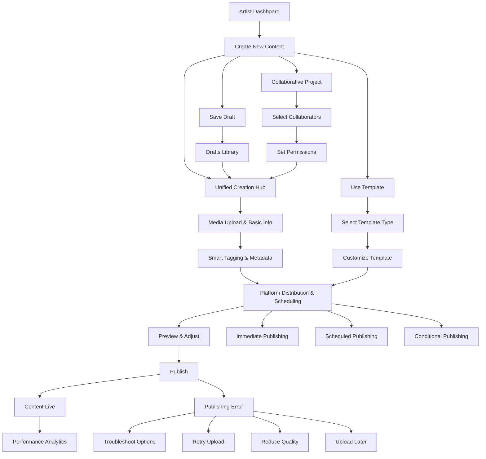

### Creation Hub Component Architecture

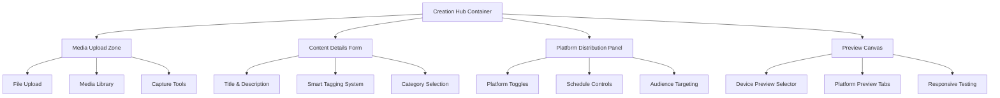

### Template System Architecture

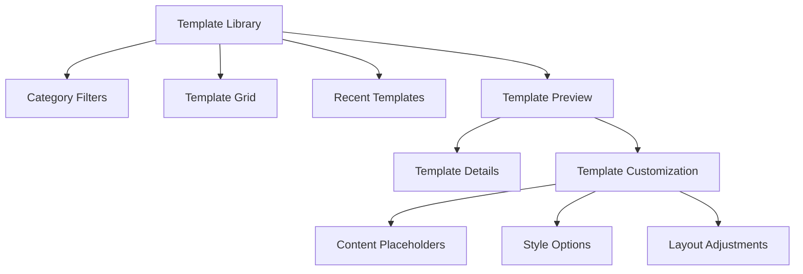

### Error Recovery System

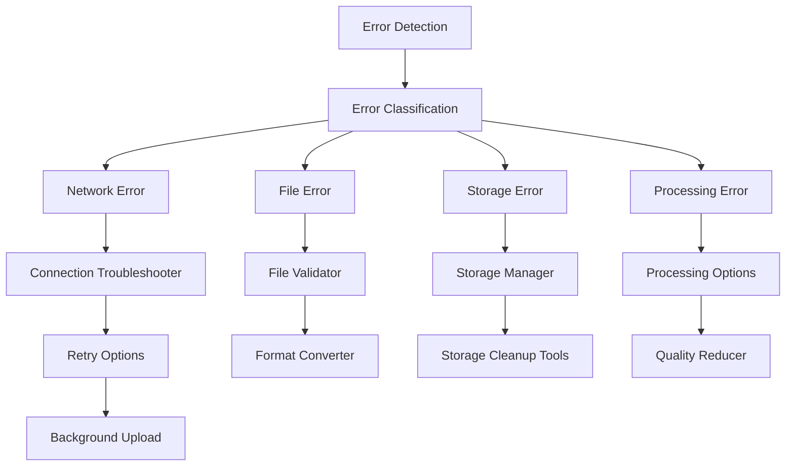

### Platform Distribution Controls

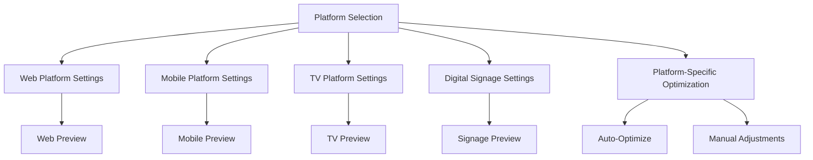

### Content Scheduling System

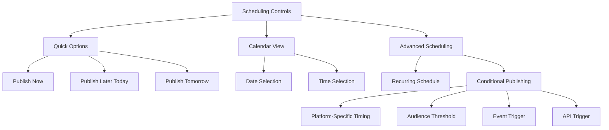

### Collaboration Integration

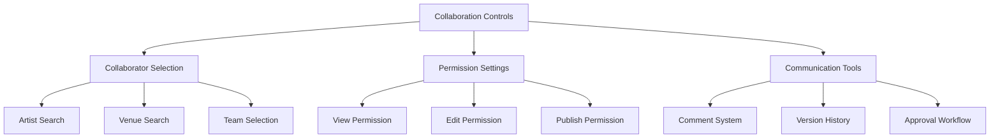

### 3.2 Venue Management Flow

### Digital Signage Management

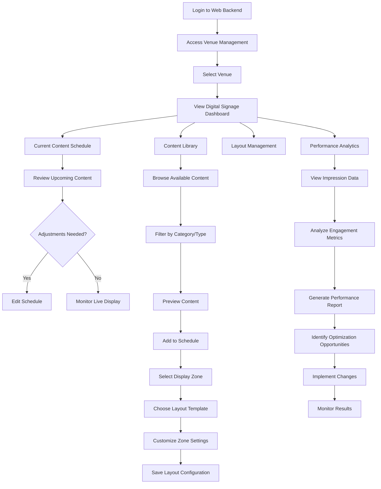

### 3.3 Audience Discovery Flow

### Content Discovery & Ticket Purchase

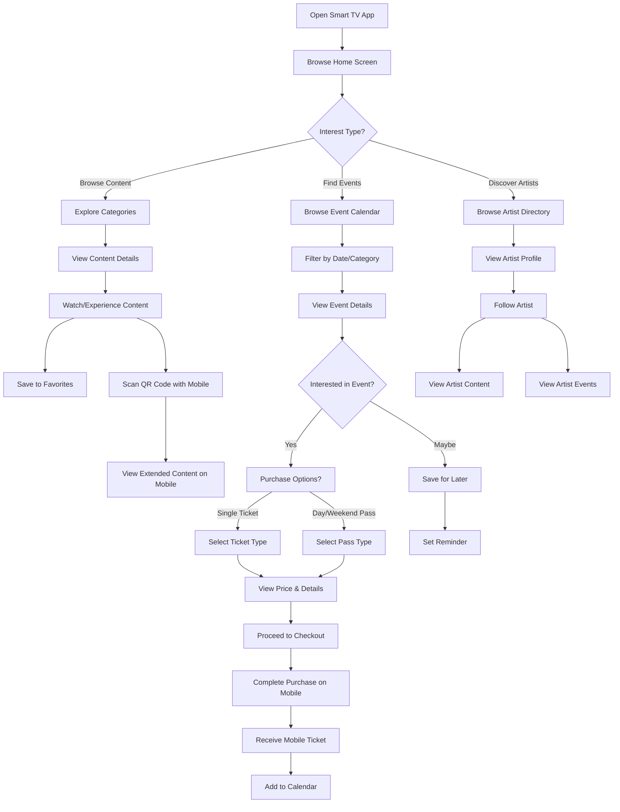

### 3.4 Administrator Flow

### Content Moderation & Approval

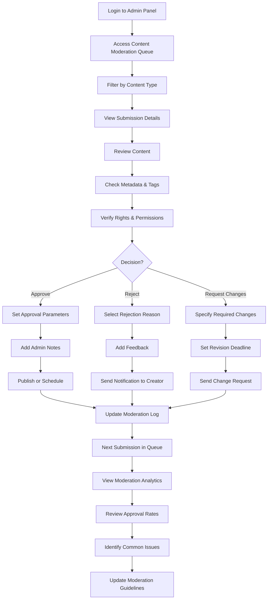

### 3.5 Cross-Platform Interactions

### Web to Digital Signage Publishing Flow

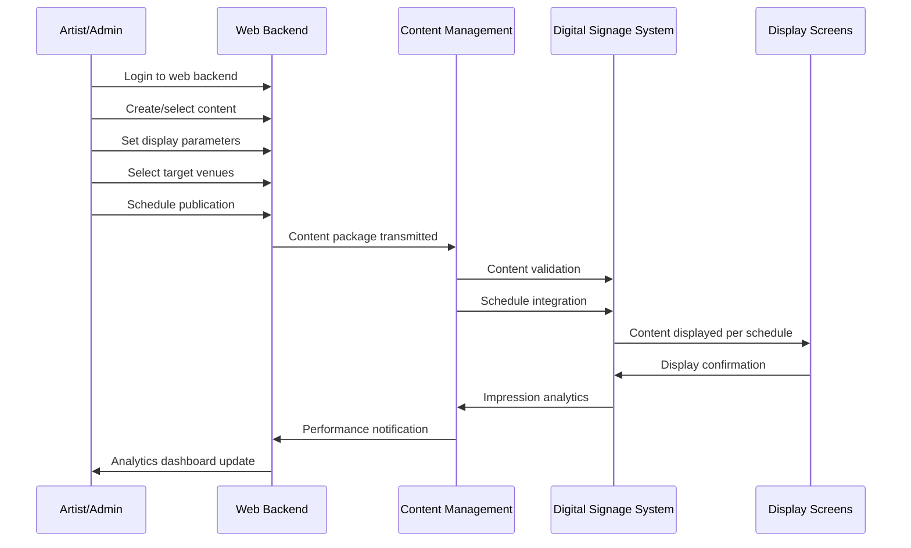

### Digital Signage to Smart TV/Mobile Interaction

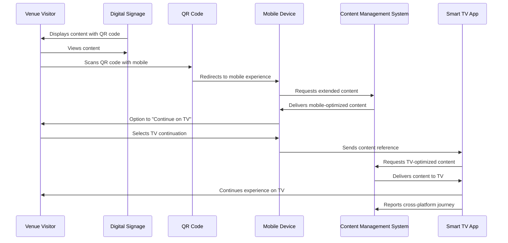

### Hotel Guest Smart TV to Mobile Ticket Purchase

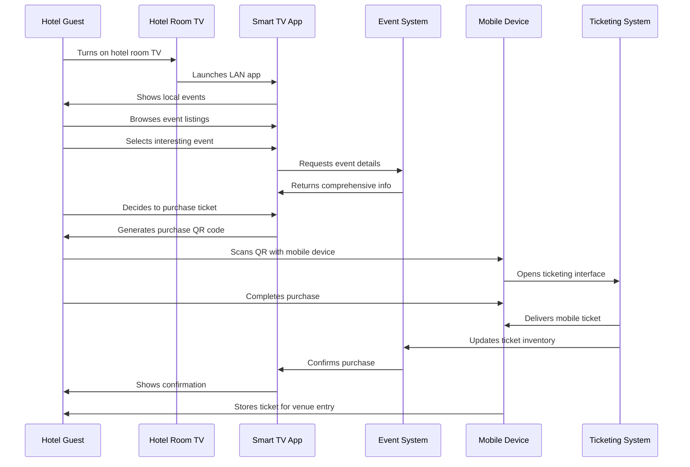

### Authentication Flow

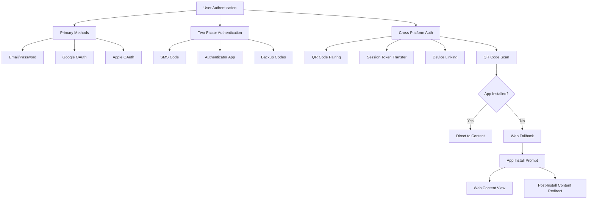

---

## 4. PLATFORM-SPECIFIC ARCHITECTURE

### 4.1 Web Backend Architecture

```mermaid
flowchart TD
    A[LAN Web Backend] --> B[Dashboard]
    A --> C[User Management]
    A --> D[Content Management]
    A --> E[Event Management]
    A --> F[Venue Management]
    A --> G[Analytics]
    A --> H[System Administration]

    B --> B1[Personalized Overview]
    B --> B2[Quick Actions]
    B --> B3[Recent Activity]
    B --> B4[Performance Metrics]

    C --> C1[Profile Management]
    C --> C2[Account Settings]
    C --> C3[Notification Preferences]
    C --> C4[Saved Content]
    C --> C5[Purchase History]

    D --> D1[Content Creation]
    D --> D2[Content Library]
    D --> D3[Publishing Workflow]
    D --> D4[Scheduling]
    D --> D5[Content Analytics]

    E --> E1[Event Creation]
    E --> E2[Event Calendar]
    
    E --> E3[Ticket Management]
		E --> E4[Day/Weekend Pass Setup]
		E --> E5[Event Analytics]
		
		F --> F1[Venue Profiles]
		F --> F2[Digital Signage Management]
		F --> F3[Venue Calendar]
		F --> F4[Venue Analytics]
		
		G --> G1[Content Performance]
		G --> G2[Audience Insights]
		G --> G3[Revenue Reports]
		G --> G4[Engagement Metrics]
		G --> G5[Custom Reports]
		
		H --> H1[User Administration]
		H --> H2[Content Moderation]
		H --> H3[System Settings]
		H --> H4[Integration Management]
		H --> H5[Access Control]

```

```mermaid

flowchart TD
    A[Digital Signage App] --> B[Content Display]
    A --> C[Scheduling]
    A --> D[Live Controls]
    A --> E[Emergency System]
    A --> F[Analytics]
    A --> G[Settings]

    B --> B1[Content Zones]
    B --> B2[Layout Templates]
    B --> B3[Content Preview]
    B --> B4[Media Library]

    C --> C1[Calendar View]
    C --> C2[Playlist Management]
    C --> C3[Recurring Schedules]
    C --> C4[Priority Settings]

    D --> D1[Live Event Mode]
    D --> D2[Real-time Updates]
    D --> D3[Audience Interaction]

    E --> E1[Alert Creation]
    E --> E2[Emergency Broadcast]
    E --> E3[Alert Templates]

    F --> F1[Impression Tracking]
    F --> F2[Audience Metrics]
    F --> F3[Content Performance]
    F --> F4[QR Code Engagement]

    G --> G1[Display Settings]
    G --> G2[Network Configuration]
    G --> G3[User Access]
    G --> G4[System Diagnostics]

```

### 4.3 Smart TV Application

```mermaid
flowchart TD
    A[Smart TV App] --> B[Home/Discovery]
    A --> C[Live Content]
    A --> D[Recorded Content]
    A --> E[Artists]
    A --> F[Venues]
    A --> G[Events]
    A --> H[User Account]

    B --> B1[Featured Content]
    B --> B2[Recommended for You]
    B --> B3[New Releases]
    B --> B4[Popular in Your Area]

    C --> C1[Live Streams]
    C --> C2[Upcoming Live Events]
    C --> C3[Live Event Details]

    D --> D1[Recently Added]
    D --> D2[Categories]
    D --> D3[Search & Filter]
    D --> D4[Saved Content]

    E --> E1[Artist Directory]
    E --> E2[Artist Profiles]
    E --> E3[Artist Content]
    E --> E4[Follow Artists]

    F --> F1[Venue Directory]
    F --> F2[Venue Profiles]
    F --> F3[Venue Events]
    F --> F4[Venue Information]

    G --> G1[Event Calendar]
    G --> G2[Event Details]
    G --> G3[Ticket Purchase]
    G --> G4[Day/Weekend Passes]

    H --> H1[Login/Register]
    H --> H2[Preferences]
    H --> H3[Viewing History]
    H --> H4[Saved Content]
    H --> H5[Language Settings]

```

### 4.4 Cross-Platform Connections

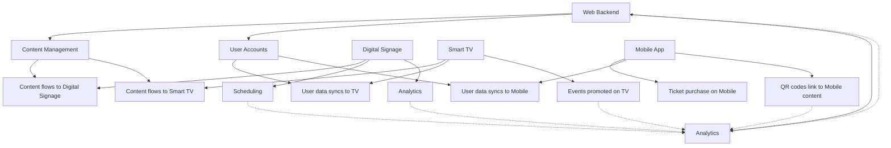

### 4.5 Comprehensive System Architecture

```mermaid
flowchart TD
    A[Core Platform] --> B[User Management]
    B --> C[Authentication]
    B --> D[Permissions]
    B --> E[Profiles]
    A --> F[Content Management]
    F --> G[Upload & Transcoding]
    F --> H[Metadata]
    F --> I[Distribution]
    F --> J[Moderation]
    A --> K[Event System]
    K --> L[Event Creation]
    K --> M[Ticketing]
    K --> N[Pass Management]
    K --> O[Revenue Distribution]
    A --> P[Analytics Engine]
    P --> Q[Interaction Tracking]
    P --> R[Impression Counting]
    P --> S[Conversion Analysis]
    P --> T[Representation Metrics]
    A --> U[Platform Interfaces]
    U --> V[Web Application]
    U --> W[Mobile Application]
    U --> X[Smart TV Application]
    U --> Y[Digital Signage System]
    A --> Z[Integration Services]
    Z --> AA[Payment Processing]
    Z --> AB[QR Code System]
    Z --> AC[Cross-Platform Continuity]
    Z --> AD[Notification Service]
    A --> AE[Business Services]
    AE --> AF[Sponsor Management]
    AE --> AG[Venue Management]
    AE --> AH[Artist Services]
    AE --> AI[Community Impact]

```

---

## 5. TECHNICAL SPECIFICATIONS

### 5.1 Content Types & Requirements

### Supported Content Types

| Content Type | Web | Mobile | Smart TV | Digital Signage | First MVP | Max Size | Formats |
| --- | --- | --- | --- | --- | --- | --- | --- |
| Still Images | ✅ | ✅ | ✅ | ✅ | ✅ | 5MB | WebP, JPEG, PNG |
| Text | ✅ | ✅ | ✅ | ✅ | ✅ | 10,000 chars | UTF-8 |
| Video | ✅ | ✅ | ✅ | ✅ | ✅ | 1GB | MP4, MOV, WebM |
| Streaming Video | ✅ | ✅ | ✅ | ✅ | ✅ | N/A | HLS, DASH |
| Audio | ✅ | ✅ | ✅ | ✅ | ❌ | 100MB | MP3, WAV, AAC |
| Slideshows | ✅ | ✅ | ✅ | ✅ | ❌ | 20MB total | JPEG, PNG, WebP |
| 3D Models | ✅ | ✅ | ✅ | ❌ | ❌ | 50MB | glTF, GLB |
| Poetry/Animated Text | ✅ | ✅ | ✅ | ✅ | ❌ | 10,000 chars | UTF-8 |
| Mixed Media | ✅ | ✅ | ✅ | ✅ | ❌ | Varies | Multiple |

### Content Processing

- Video and audio content will be transcoded via api.video
- Multiple resolutions will be generated for adaptive streaming
- Images will be automatically optimized for each platform
- Content will be cached at CDN edge locations for performance
- Offline content will be stored in device-appropriate formats

### Display Requirements

**Digital Signage Display Rules:**

| Location | Motion | Audio | Brightness | Refresh Rate | Content Rules |
| --- | --- | --- | --- | --- | --- |
| Indoor (100+ ft from window) | Full motion allowed | Audio optional | Standard | As needed | No restrictions |
| Window-facing | Limited motion | No audio | Reduced at night | Max 1/minute | City regulations apply |
| Public space (<100ft from pedestrians) | Limited motion | No audio | Reduced at night | Max 1/minute | City regulations apply |

**Custom Venue Content:**

- Venues can display custom content (menus, hours, events)
- Custom content reduces available sponsor impression time
- Custom content must follow same display rules based on location

### 5.2 Internationalization Requirements

### Language Support

- Interface supports multiple languages via external JSON files
- Translation files follow standard i18n format
- Users can select language preference in settings
- Default language determined by browser/device setting
- Right-to-left (RTL) layout support for appropriate languages

### Regional Adaptations

| Feature | Adaptation |
| --- | --- |
| Date/Time | Follows local format conventions |
| Currency | Displays in user's preferred currency with conversion info |
| Units | Adapts distance/measurements to local standards |
| Content | Prioritizes local/regional content when location enabled |
| Compliance | Adapts to regional regulatory requirements |

### 5.3 Offline Functionality

### Mobile App Offline Capabilities

| Feature | Offline Capability |
| --- | --- |
| Content Viewing | Downloaded content available offline |
| Tickets | Stored tickets accessible without connection |
| Content Creation | Draft saving with sync when reconnected |
| Analytics | Cache user interactions for upload when online |
| Event Details | Save event information for offline access |

### Synchronization

- Background synchronization when connection restored
- Conflict resolution for edited content
- Queue system for pending uploads
- Bandwidth-aware sync for large media files
- User notification of sync status

### 5.4 QR Code Implementation

### Digital Signage QR Codes

- Each QR code is unique and changes after being scanned
- QR code scan triggers visual state change on digital signage
- New QR code generated immediately after scanning
- Analytics track each scan and resulting conversion
- QR codes link to web or deep link to app if installed

### QR Code Handling

| Scenario | Behavior |
| --- | --- |
| App Installed | Deep link to specific content in app |
| No App | Web version with installation prompt |
| Hotel Room | Direct link to ticketing system |
| Offline Scanning | App stores scan for later resolution |

### 5.5 Content Moderation System

### Moderation Workflow

- User profile content published without approval
- Digital signage content requires admin review
- Admins review requested impressions, timeframe, venue preferences
- Content admin and super admin roles with different permissions
- All moderation decisions logged for accountability

### Moderation Rules

| Content Type | Rules |
| --- | --- |
| Artist Content | No approval needed for personal profile |
| Venue Content | No approval for venue profile content |
| Public Signage | Admin approval required |
| Sponsored Content | Admin approval with additional guidelines |

### Emergency Takedown

- Any admin can trigger emergency takedown
- Content immediately removed pending review
- Three inappropriate takedown requests result in privilege removal
- Appeals process available for rejected content

### 5.6 Ticketing and Revenue Model

### Ticketing System

- Mobile-only ticket purchasing and management
- Account-based ticketing tied to user profiles
- QR codes for venue entry with scanning validation
- Tickets synced for offline access
- Multiple ticket classes with different venue access levels

### Pass System

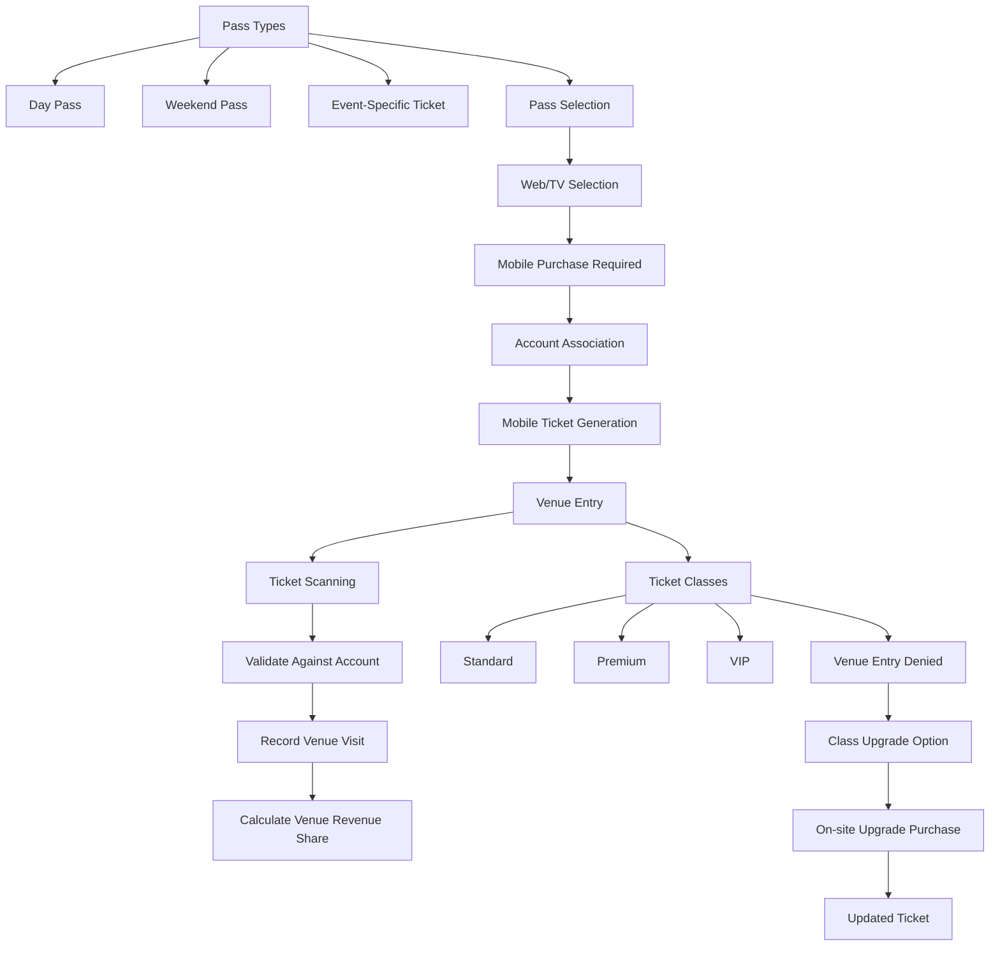

### Revenue Distribution Model

```mermaid
flowchart TD
    A[Ticket Purchase] --> B[Platform Fee]
    B --> C[Distributable Revenue]
    C --> D[Venue Visit Tracking]
    D --> E[Calculate Per-Venue Share]
    E --> F[Apply Venue Maximum Cap]
    F --> G[Apply Ticket Class Multiplier]
    G --> H[Settlement Period]
    H --> I[Calculate Final Distributions]
    I --> J[Process Payments to Venues]
    J --> K[Generate Financial Reports]
    D --> L[Venue Settings]
    L --> M[Set Ticket Class Requirements]
    L --> N[Set Maximum Revenue Cap]
    L --> O[Set Revenue Share Percentage]

```

### 5.7 Hotel Integration Requirements

### Hotel TV Experience

```mermaid
flowchart TD
    A[Hotel TV Home Screen] --> B[Priority Content]
    B --> C[Nearby Events Starting Soon]
    B --> D[Currently Streaming Events]
    B --> E[In-Hotel Activities]
    A --> F[Hotel-Specific Content]
    F --> G[Hotel Information]
    F --> H[Amenities]
    F --> I[Local Recommendations]
    A --> J[Event Discovery]
    J --> K[Browse Events]
    K --> L[Select Event]
    L --> M[View Details]
    M --> N[Generate Mobile Purchase QR]
    A --> O[Content Playback]
    O --> P[Images]
    O --> Q[Text]
    O --> R[Pre-recorded Video]
    O --> S[Streaming Video]

```

### Hotel-Specific Requirements

- Hotel ability to customize content for their guests
- Prioritization of nearby events and in-hotel activities
- QR code generation for mobile ticket purchase
- Simple remote control navigation
- Auto-login for hotel room TVs

### 5.8 Sponsor Integration

### Sponsor Management

- Sponsor dashboard for campaign management
- Impression bidding system based on analytics
- Venue and time-slot targeting options
- Performance reporting and ROI metrics
- Creative asset management and approval workflow

### Content Rotation

| Content Type | Allocation |
| --- | --- |
| Sponsor Content | Configurable % of display time |
| Venue Custom Content | Configurable % of display time |
| Platform Content | Remaining display time |
| Emergency Alerts | Override all content when active |

### Analytics

- Impression tracking by venue, time, and audience
- Conversion tracking for QR code scans
- Audience demographics when available
- Comparison reporting across campaigns
- ROI calculation based on conversions

### 5.9 Analytics Requirements

### Core Analytics Metrics

| Category | Metrics |
| --- | --- |
| Traffic | Visits, unique users, session duration, platform breakdown |
| Content | Views, completion rate, engagement, shares |
| QR Codes | Scans, conversion rate, time to action |
| Tickets | Sales, revenue, class breakdown, venue distribution |
| Venues | Visitors, peak times, popular content, ticket validations |
| Artists | Profile views, content performance, follower growth |

### Representation Tracking

```mermaid
flowchart TD
    A[Content Metadata] --> B[Cultural Tags]
    A --> C[Historical Significance]
    A --> D[Community Representation]
    A --> E[Display Time Management]
    E --> F[Impression Allocation]
    F --> G[Cultural Representation Quotas]
    F --> H[Historical Content Requirements]
    F --> I[Community Balance]
    A --> J[Reporting]
    J --> K[Representation Analytics]
    J --> L[Quota Fulfillment Tracking]
    J --> M[Balance Recommendations]

```

---

## 6. IMPLEMENTATION PLAN

### 6.1 Phased Approach

```mermaid
flowchart TD
    A[Phase 1: MVP] --> B[Basic Content Upload]
    A --> C[Simple Content Display]
    A --> D[QR Code to Web Purchase]
    A --> E[Phase 2: Platform Expansion]
    E --> F[Web App Refinement]
    E --> G[Smart TV Web App]
    E --> H[Sponsor Integration]
    E --> I[Phase 3: Full Feature Set]
    I --> J[Native Mobile App]
    I --> K[Native Smart TV App]
    I --> L[Advanced Analytics]
    I --> M[Phase 4: Sundance Integration]
    M --> N[Full Ticketing System]
    M --> O[Hotel Room Integration]
    M --> P[Multi-Venue Navigation]
    M --> Q[Future Expansion]
    Q --> R[Token Economy]
    Q --> S[Home Smart TV Support]
    Q --> T[Advanced Content Types]

```

### 6.2 Initial Venue Deployment

```mermaid
flowchart TD
    A[Two Initial Venues] --> B[Basic Display Setup]
    B --> C[Computer + TV Configuration]
    B --> D[Web App Interface]
    A --> E[Manual Content Management]
    E --> F[Simple Upload Interface]
    E --> G[Admin-Assisted Data Entry]
    A --> H[Beta Testing]
    H --> I[Feature Iteration]
    H --> J[Analytics Collection]
    A --> K[Sponsor Integration]
    K --> L[Basic Impression Tracking]
    K --> M[Simple Reporting]

```

### 6.3 Development Priorities

1. **Content Publishing Workflow** - Critical MVP component
    - Background upload and transcoding
    - Platform-specific preview
    - Basic scheduling
2. **Digital Signage Display** - Essential for venue value proposition
    - Basic content rotation
    - QR code generation and tracking
    - Simple layout management
3. **Web Backend** - Core administration platform
    - User authentication
    - Content management
    - Basic analytics
4. **Mobile Ticketing** - Revenue generation capability
    - Simple purchase flow
    - QR code tickets
    - Venue scanning validation
5. **Smart TV Interface** - Hotel guest experience
    - Content browsing
    - Event discovery
    - QR code handoff to mobile

### 6.4 Timeline & Milestones

| Milestone | Timeframe | Key Deliverables |
| --- | --- | --- |
| Technical Prototype | Month 1 | Basic content upload/display, Web backend |
| Two-Venue MVP | Month 2-3 | Digital signage at two venues, QR code system |
| Platform Expansion | Month 3-6 | Smart TV web app, Sponsor integration, Basic mobile web |
| Full Feature Set | Month 6-9 | Native mobile app, Native TV app, Advanced analytics |
| Sundance Integration | Month 9-12 | Complete ticketing system, Hotel integration, Multi-venue system |

---

## 7. INTEGRATIONS & DEPENDENCIES

### 7.1 External Services

| Service | Purpose | Integration Point |
| --- | --- | --- |
| api.video | Video hosting and streaming | Content transcoding, adaptive streaming |
| Stripe/PayPal | Payment processing | Ticket purchases, revenue distribution |
| Google/Apple OAuth | Authentication | User login, device authentication |
| CDN Provider | Content delivery | Media file distribution |
| Analytics Platform | Data collection and analysis | User behavior tracking, reporting |

### 7.2 Technical Requirements

### Browser Support

| Browser | Minimum Version |
| --- | --- |
| Chrome | 89+ |
| Firefox | 86+ |
| Safari | 14+ |
| Edge | 88+ |
| Opera | 74+ |

### Device Requirements

| Platform | Requirements |
| --- | --- |
| Web | Modern browser, 1024x768 minimum resolution |
| Mobile | iOS 14+, Android 10+ |
| Smart TV | WebOS 5.0+, Tizen 5.5+, Android TV 9.0+ |
| Digital Signage | Chrome OS, Windows 10+, or Linux |

### Network Requirements

| Feature | Minimum Bandwidth | Recommended |
| --- | --- | --- |
| Content Browsing | 3 Mbps | 10+ Mbps |
| Video Streaming | 5 Mbps | 25+ Mbps |
| Live Streaming | 8 Mbps | 30+ Mbps |
| Content Upload | 2 Mbps upload | 10+ Mbps upload |

### 7.3 Regulatory & Compliance

```mermaid
flowchart TD
    A[Regulatory Requirements] --> B[City Signage Regulations]
    A --> C[Privacy Compliance]
    A --> D[Accessibility Standards]
    B --> E[Display Location Classification]
    E --> F[Street-Facing Rules]
    E --> G[Indoor Rules]
    C --> H[Privacy Flag System]
    H --> I[Immediate Takedown]
    H --> J[Dispute Resolution]
    B --> K[Content Guidelines]
    K --> L[Motion Restrictions]
    K --> M[Brightness Standards]
    K --> N[Content Appropriateness]

```

---

## 8. CRITICAL TASK ANALYSIS

### 8.1 Artist Critical Tasks

| Task | Frequency | Complexity | Potential Pain Points | Solutions | Success Metrics |
| --- | --- | --- | --- | --- | --- |
| Content Creation & Upload | Very High | Medium | File size limitations, format compatibility | Batch upload, format conversion, progress indicators | Upload success rate, time to publish |
| Schedule Management | High | Medium | Scheduling conflicts, timezone issues | Calendar visualization, conflict alerts, timezone display | Scheduling accuracy, conflict resolution time |
| Performance Analytics Review | Medium | High | Data complexity, actionable insights | Visual dashboards, insight summaries, recommendation engine | Time spent analyzing, optimization actions taken |
| Profile & Portfolio Updates | Low | Low | Content organization, presentation consistency | Templates, preview functionality, guided workflows | Profile completeness, update frequency |
| Event Creation | Medium | Medium | Incomplete information, venue coordination | Step-by-step wizard, templates, venue integration | Event creation completion rate, information accuracy |

### 8.2 Venue Critical Tasks

| Task | Frequency | Complexity | Potential Pain Points | Solutions | Success Metrics |
| --- | --- | --- | --- | --- | --- |
| Content Scheduling | High | Medium | Content overload, prioritization | Visual calendar, drag-drop interface, priority indicators | Schedule conflicts, content diversity |
| Digital Signage Management | Very High | Medium | Remote troubleshooting, layout issues | Remote preview, health monitoring, template system | Uptime percentage, display accuracy |
| Event Coordination | Medium | High | Artist communication, resource allocation | Integrated messaging, resource visualization, checklists | Coordination issues, preparation time |
| Audience Analytics | Medium | Medium | Data interpretation, actionable insights | Trend visualization, benchmark comparisons, recommendation engine | Data-driven decisions, optimization frequency |
| Emergency Messaging | Low | Low | Speed of deployment, visibility | One-click emergency mode, templates, override controls | Deployment time, visibility confirmation |

### 8.3 Audience Critical Tasks

| Task | Frequency | Complexity | Potential Pain Points | Solutions | Success Metrics |
| --- | --- | --- | --- | --- | --- |
| Content Discovery | Very High | Low | Information overload, relevance | Personalization, clear categories, search filters | Time to find relevant content, discovery satisfaction |
| Ticket Purchase | High | Medium | Decision complexity, checkout friction | Clear pricing, streamlined checkout, saved payment info | Cart abandonment rate, purchase completion time |
| Event Information Review | High | Low | Incomplete information, updates | Comprehensive details, update notifications, save to calendar | Information completeness, update visibility |
| Artist/Venue Exploration | Medium | Low | Navigation depth, connection to content | Related content links, intuitive navigation, breadcrumbs | Exploration depth, cross-content engagement |
| Content Saving/Sharing | Medium | Low | Process complexity, platform transitions | One-click actions, cross-platform continuity, share previews | Save/share completion rate, cross-platform continuation |

### 8.4 Administrator Critical Tasks

| Task | Frequency | Complexity | Potential Pain Points | Solutions | Success Metrics |
| --- | --- | --- | --- | --- | --- |
| Content Moderation | Very High | Medium | Volume management, consistency | Queue prioritization, guideline references, batch actions | Moderation throughput, consistency score |
| User Management | Medium | Medium | Permission complexity, account issues | Role templates, search/filter tools, audit logs | Time to resolve issues, permission accuracy |
| System Monitoring | High | High | Alert fatigue, root cause analysis | Priority-based alerts, diagnostic tools, historical comparisons | Issue resolution time, false positive rate |
| Analytics Review | Medium | High | Data volume, insight extraction | Executive dashboards, automated reports, anomaly detection | Time to insight, action implementation |
| Network-wide Coordination | Low | Very High | Communication gaps, consistency | Central coordination tools, templates, approval workflows | Coordination efficiency, consistency across network |

---

## 9. UI MOCKUPS

### 9.1 Creation Hub - Main Interface

```
+-------------------------------------------------------+
|  CREATION HUB                                [DRAFT]  |
+-------------------------------------------------------+
|                                                       |
|  +----------------+  +---------------------------+    |
|  | UPLOAD MEDIA   |  | TITLE:                    |    |
|  | +------------+ |  | [New Exhibition Showcase] |    |
|  | |            | |  +---------------------------+    |
|  | |    DROP    | |                                   |
|  | |    FILES   | |  DESCRIPTION:                     |
|  | |    HERE    | |  +---------------------------+    |
|  | |            | |  | Contemporary photography   |    |
|  | +------------+ |  | exhibition featuring...    |    |
|  |                |  +---------------------------+    |
|  | [UPLOAD]       |                                   |
|  | [MEDIA LIBRARY]|  SMART TAGS:                      |
|  +----------------+  [Photography] [Exhibition] [Art] |
|                                                       |
+-------------------------------------------------------+
|                                                       |
|  PLATFORM DISTRIBUTION                                |
|  +------+  +------+  +-----+  +----------------+     |
|  | WEB  |  |MOBILE|  | TV  |  |DIGITAL SIGNAGE |     |
|  |  ✓   |  |  ✓   |  |  ✓  |  |       ✓        |     |
|  +------+  +------+  +-----+  +----------------+     |
|                                                       |
|  SCHEDULING:                                          |
|  (•) Publish Now                                      |
|  ( ) Schedule for Later                               |
|  ( ) Recurring Schedule                               |
|                                                       |
+-------------------------------------------------------+
|                                                       |
|  PREVIEW                                              |
|  +------+  +------+  +-----+  +----------------+     |
|  | WEB  |  |MOBILE|  | TV  |  |DIGITAL SIGNAGE |     |
|  +------+  +------+  +-----+  +----------------+     |
|                                                       |
|  +-------------------------------------------+        |
|  |                                           |        |
|  |                                           |        |
|  |           CONTENT PREVIEW                 |        |
|  |                                           |        |
|  |                                           |        |
|  +-------------------------------------------+        |
|                                                       |
+-------------------------------------------------------+
|                                                       |
|  [SAVE DRAFT]    [PREVIEW]    [BACK]    [PUBLISH]    |
|                                                       |
+-------------------------------------------------------+

```

### 9.2 Error Recovery Interface

```
+-------------------------------------------------------+
|  UPLOAD ISSUE DETECTED                      [HELP]    |
+-------------------------------------------------------+
|                                                       |
|  ⚠️ We're having trouble uploading your video file    |
|                                                       |
|  ISSUE DETECTED:                                      |
|  Your video file (exhibition-tour.mp4) is 2.3GB,      |
|  which exceeds the maximum file size of 1GB.          |
|                                                       |
|  RECOMMENDED SOLUTIONS:                               |
|                                                       |
|  [✓] REDUCE FILE SIZE                                 |
|      We can automatically compress your video to      |
|      meet the size requirements while maintaining     |
|      good quality.                                    |
|                                                       |
|  [ ] SPLIT INTO MULTIPLE UPLOADS                      |
|      Divide your content into multiple shorter        |
|      videos that can be linked together.              |
|                                                       |
|  [ ] UPLOAD TO EXTERNAL SERVICE                       |
|      Upload to YouTube/Vimeo and link the content.    |
|                                                       |
|  [ ] SAVE AS DRAFT                                    |
|      Save your progress and resolve this later.       |
|                                                       |
+-------------------------------------------------------+
|                                                       |
|  [CANCEL]    [SAVE DRAFT]    [PROCEED WITH SELECTED]  |
|                                                       |
+-------------------------------------------------------+

```

### 9.3 Platform Distribution Panel

```
+-------------------------------------------------------+
|  PLATFORM DISTRIBUTION                       [HELP]   |
+-------------------------------------------------------+
|                                                       |
|  SELECT WHERE YOUR CONTENT WILL APPEAR:              |
|                                                       |
|  [✓] WEB PLATFORM                                     |
|      → Appears in: Artist Profile, Explore Feed,      |
|        Search Results                                 |
|      → Optimized for: Desktop and tablet viewing      |
|                                                       |
|  [✓] MOBILE APP                                       |
|      → Appears in: Mobile Feed, Nearby Content,       |
|        Notifications                                  |
|      → Optimized for: On-the-go discovery             |
|                                                       |
|  [✓] SMART TV                                         |
|      → Appears in: Featured Content, Category         |
|        Browsing, Hotel Recommendations                |
|      → Optimized for: Lean-back viewing experience    |
|                                                       |
|  [✓] DIGITAL SIGNAGE                                  |
|      → Appears in: Selected venue displays            |
|      → Select venues:                                 |
|        [✓] Gallery 23                                 |
|        [✓] Downtown Arts District                     |
|        [ ] Hotel Lobby Displays                       |
|        [+] Add more venues                            |
|                                                       |
|  [AUTO-OPTIMIZE FOR ALL PLATFORMS]                    |
|                                                       |
+-------------------------------------------------------+
|                                                       |
|  [BACK]                     [CONTINUE TO PREVIEW]     |
|                                                       |
+-------------------------------------------------------+

```

### 9.4 Smart TV Home Screen

```
+-------------------------------------------------------+
|  LAN - LOCAL ARTIST NETWORK                           |
+-------------------------------------------------------+
|                                                       |
|  FEATURED EVENTS NEAR YOU                             |
|  +------------+  +------------+  +------------+       |
|  |            |  |            |  |            |       |
|  |  SYMPHONY  |  |   PHOTO    |  |   JAZZ     |       |
|  |  CONCERT   |  |  EXHIBIT   |  |  FESTIVAL  |       |
|  |            |  |            |  |            |       |
|  | TONIGHT 8PM|  | NOW-MAR 30 |  | THIS WEEKEND|      |
|  +------------+  +------------+  +------------+       |
|                                                       |
|  STREAMING NOW                                        |
|  +------------+  +------------+  +------------+       |
|  |            |  |            |  |            |       |
|  |   POETRY   |  |  ACOUSTIC  |  |  PAINTING  |       |
|  |   READING  |  |   CONCERT  |  |  WORKSHOP  |       |
|  |
|  |            |  |            |  |            |       |
|  |   LIVE    |  |    LIVE    |  |   LIVE     |       |
|  +------------+  +------------+  +------------+       |
|                                                       |
|  HOTEL ACTIVITIES                                     |
|  +------------+  +------------+  +------------+       |
|  |            |  |            |  |            |       |
|  |  ROOFTOP   |  | LOBBY ART  |  |  GUEST     |       |
|  |  CONCERT   |  |  DISPLAY   |  |  MIXER     |       |
|  |            |  |            |  |            |       |
|  | TOMORROW 7PM|  | DAILY     |  | FRIDAY 6PM |       |
|  +------------+  +------------+  +------------+       |
|                                                       |
|  BROWSE:                                              |
|  [EVENTS] [ARTISTS] [VENUES] [CATEGORIES] [SAVED]     |
|                                                       |
+-------------------------------------------------------+
```

```

### 9.5 Mobile Ticket Display
+----------------------------+
|                            |
|  LAN - LOCAL ARTIST NETWORK|
+----------------------------+
|                            |
|       JAZZ FESTIVAL        |
|                            |
|  WEEKEND PASS - PREMIUM    |
|                            |
|  MARCH 29-31, 2025         |
|                            |
|  DOWNTOWN ARTS DISTRICT    |
|                            |
|  +--------------------+    |
|  |                    |    |
|  |                    |    |
|  |       QR CODE      |    |
|  |                    |    |
|  |                    |    |
|  +--------------------+    |
|                            |
|  TICKET ID: JAZ-25-WP-1234 |
|                            |
|  ACCESS: All festival venues|
|  CLASS: Premium access     |
|                            |
|  [VIEW SCHEDULE]           |
|  [GET DIRECTIONS]          |
|                            |
+----------------------------+

```

```

## 10. APPENDIX

### 10.1 Glossary

| Term | Definition |
|-----|-----|
| LAN | Local Artist Network - the complete platform ecosystem |
| Digital Signage | Public displays at venues showing artistic content and information |
| Day/Weekend Pass | Multi-venue access ticket for specified time period |
| Creation Hub | Unified interface for content creation and publishing |
| QR Code | Quick Response code for linking physical displays to mobile experiences |
| Smart TV App | Application for television interfaces including hotel room TVs |
| Content Admin | User role responsible for moderating and approving content |
| Venue Admin | User role responsible for managing venue content and displays |
| Artist | Content creator who publishes work on the platform |
| Audience | End users who consume content and attend events |
| Sponsor | Organizations or individuals who pay for promotional content |

### 10.2 Technical Stack Recommendations

| Component | Technology | Rationale |
|-----|-----|-----|
| Frontend Framework | React + TypeScript | Component-based architecture, type safety |
| Mobile App | React Native | Code sharing with web platform |
| TV App | React Native for TV | Code sharing across platforms |
| Backend | Node.js + Express | JavaScript across stack, strong ecosystem |
| Database | PostgreSQL + Redis | Relational data + caching |
| Authentication | JWT + OAuth | Standard, secure auth flow |
| Media Processing | api.video | Specialized video handling |
| CDN | CloudFront/Cloudflare | Global distribution, edge caching |
| Hosting | AWS/GCP | Scalability, managed services |
| Analytics | Mixpanel/Amplitude | Purpose-built for user analytics |

### 10.3 Accessibility Requirements

| Requirement | Implementation |
|-----|-----|
| Color Contrast | All text meets WCAG 2.1 AA (4.5:1 ratio) |
| Keyboard Navigation | All interactive elements accessible via keyboard |
| Screen Reader Support | ARIA labels, semantic HTML, proper focus management |
| Text Alternatives | Alt text for all images, captions for video |
| Responsive Text | Text scaling without breaking layouts |
| Focus Visibility | High contrast focus indicators |
| Error Identification | Multiple cues for errors (color, text, icons) |
| Motion Control | Respects reduced motion preferences |
| Form Labels | All form controls have associated labels |

### 10.4 Content Guidelines

#### Content Specifications

| Content Type | Specifications |
|-----|-----|
| Images | 1200x675px minimum, 16:9 aspect ratio, 5MB max |
| Videos | 1080p max, 2 minutes recommended duration, 1GB max |
| Text | 10,000 characters maximum |
| Audio | 320kbps quality, 5 minutes recommended, 100MB max |

#### Moderation Guidelines

| Category | Guidelines |
|-----|-----|
| Prohibited Content | No explicit sexual content, graphic violence, hate speech, illegal activities |
| Restricted Content | Age-appropriate flagging, content warnings when needed |
| Copyright | All content must be original or properly licensed |
| Attribution | Credit required for collaborative or derivative works |
| Quality Standards | Minimum resolution, legibility, audio quality requirements |

### 10.5 Testing Plan

#### Functional Testing

| Area | Testing Focus |
|-----|-----|
| Content Creation | Upload, preview, publishing across platforms |
| User Authentication | Login, registration, cross-platform auth |
| Ticketing | Purchase, validation, revenue distribution |
| QR Code Handling | Generation, scanning, handoff experience |
| Offline Support | Content availability, synchronization |

#### Performance Testing

| Metric | Target |
|-----|-----|
| Page Load Time | < 2 seconds for web, < 3 seconds for TV |
| Upload Processing | < 5 minutes for 100MB file |
| Concurrent Users | 1,000+ simultaneous users per region |
| API Response Time | < 200ms for 95% of requests |
| Memory Usage | < 200MB for mobile app |

#### User Testing Scenarios

1. **Artist Content Publication**
   - Create and publish content to all platforms
   - Schedule future content releases
   - Review performance analytics

2. **Venue Digital Signage Management**
   - Configure content display zones
   - Schedule content rotation
   - Monitor impression analytics

3. **Audience Discovery and Ticketing**
   - Browse content on TV app
   - Purchase tickets via mobile
   - Use tickets for venue entry

4. **Hotel Guest Experience**
   - Discover local events from hotel TV
   - Transfer to mobile for ticket purchase
   - Navigate between multiple venues

5. **Administrator Content Moderation**
   - Review submitted content
   - Approve/reject with feedback
   - Generate moderation reports

### 10.6 Future Expansion Considerations

#### Token Economy

- Artist/creator rewards system
- Fan engagement incentives
- Content purchase using platform tokens
- Transferable tickets and collectibles

#### Advanced Content Types

- AR/VR art experiences
- Interactive installations
- Multi-user collaborative art
- Location-based creative experiences

#### Advanced Analytics

- Predictive audience modeling
- Content recommendation engine
- Dynamic pricing for events
- Cross-venue attendance patterns
```